# M05UF2_AC2
### Aqui estara tota la documentació d'aquesta activitat.
## PAS 1:
- Crearem un nou projecte al Visual Studio i també crearem un repositori d'aquest projecte, ja sigui a través del Github o directament des del Visual.

  (En el meu cas direcatement des del visual)

  

- Configuramen el nostre repositori tal i com ens demana, en public, amb un README.md, etc. I hauria de quedar d'aquesta manera.
 
  

## PAS 2:
- Creem un nou projecte al Github on indicarem totes les tasques que hauriem de fer en el projecte. El projecte ha d'estar configurat en public per que la gent pugui veure les tasques.

  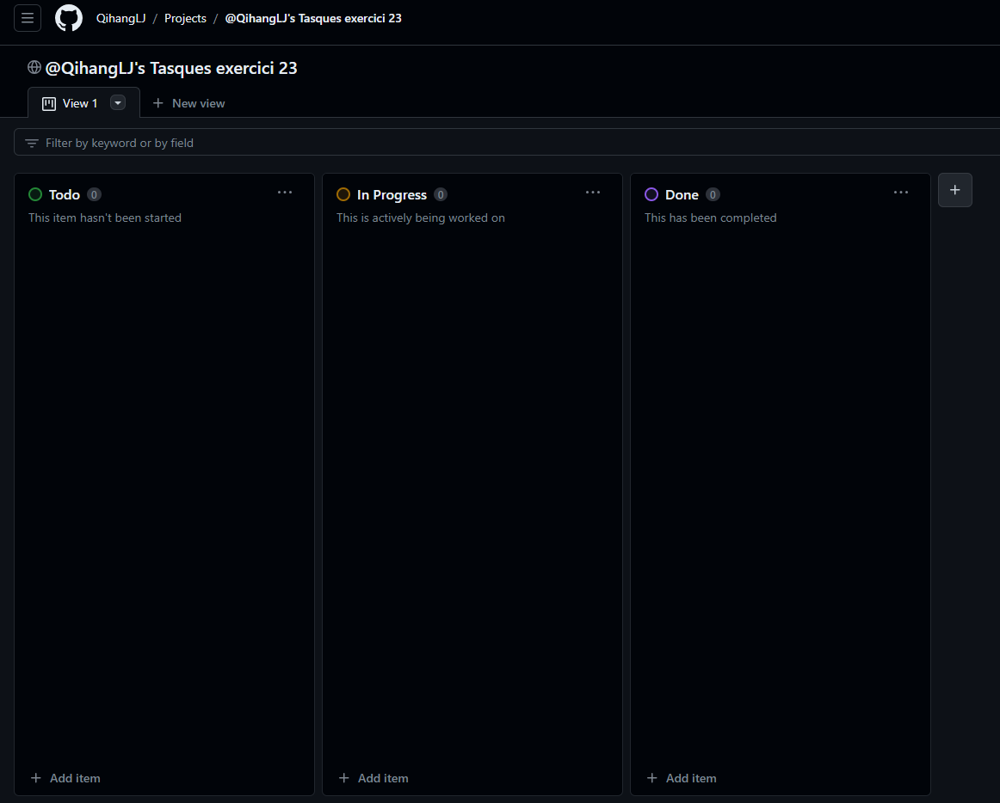

- Anem afegint les tasques que veiem necesaris per completar el que ens demana en els exercicis. AL principi veurem que a l'hora d'afegir una tasca ens el deixa com en "esborrany", nosaltres haurem d'asignar aquelles tasques en algun repositori. Finalment quan ja els haguem asignat, veurem que al costat del repositori asignat tenim un # amb un num.

  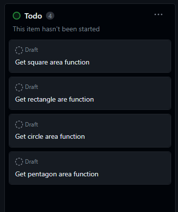
  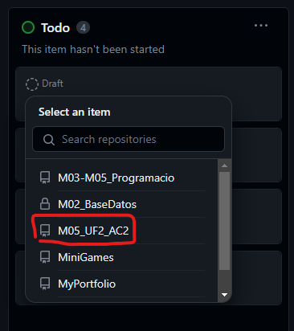
  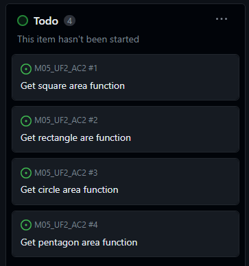

- Mourem aquestes tasques a la columna de "In progress", deslizant directament amb el ratoli. Aquesta columan estaran totes les tasques que el desenvolupador esta fent.

  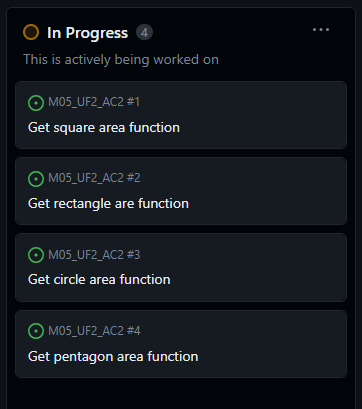

- Després de configurar tot el projectem el vincularem amb el nostre repostitori.

  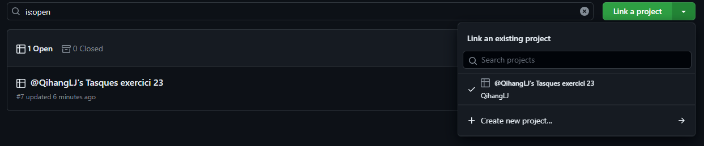

## PAS 3:
- Després de fer un push del primer commit amb la base del nostre programa a la branca master, tot el que farem ara es pujarà través d'altres branques i es vincularà (merge) a la master mitjançant revisions amb el pull requests.

  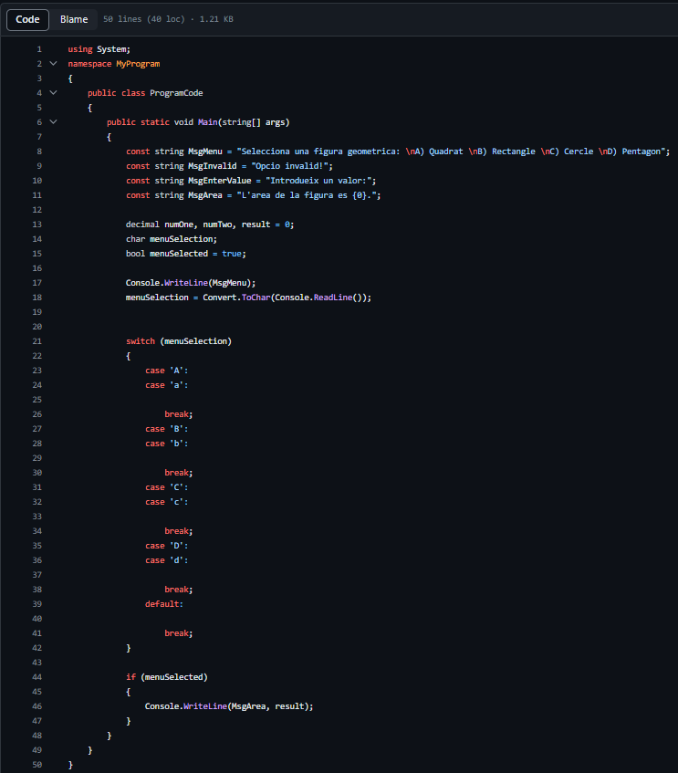

## PAS 4:
- Creem les branques on farem els push, hem de crear una branca feature y després crearem més branques feature basat en el primer y amb totes les funcions que ens demanin.

  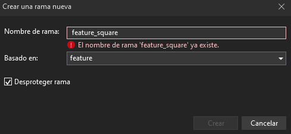

- Anirem programant per completar les nostres tasques i una vegada que ya hem acabat una tasca, fem un commit i després un push al nostre repositori online a través d'una branca que no sigui el master. A l'hora de fer el push hem d'indicar la tasca que volem tancar amb un "close #(num tasca)", en aquest cas era la tasca 1, llavors seria "closes #1" al final del missatge del commit

  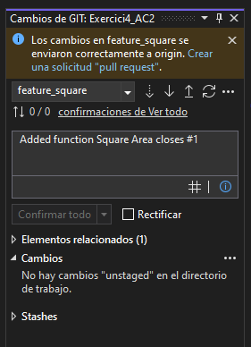

## PAS 5:
- Després de solicitar el pull request, el revisor haurà de revisar o comprobar el codi i si compleix amb els requesitis que ens demana, llavors fara un merge i el pujarà a la branca master.

  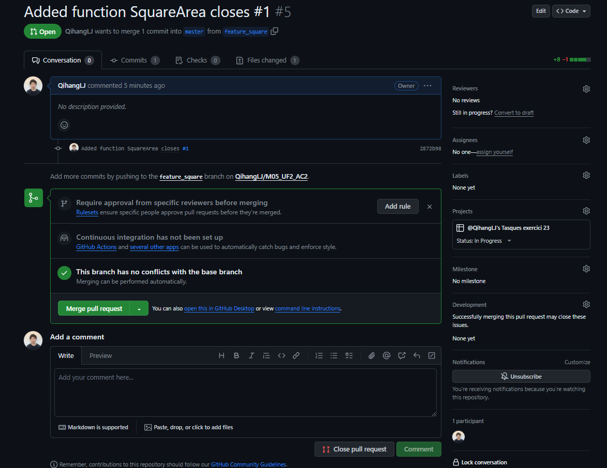
  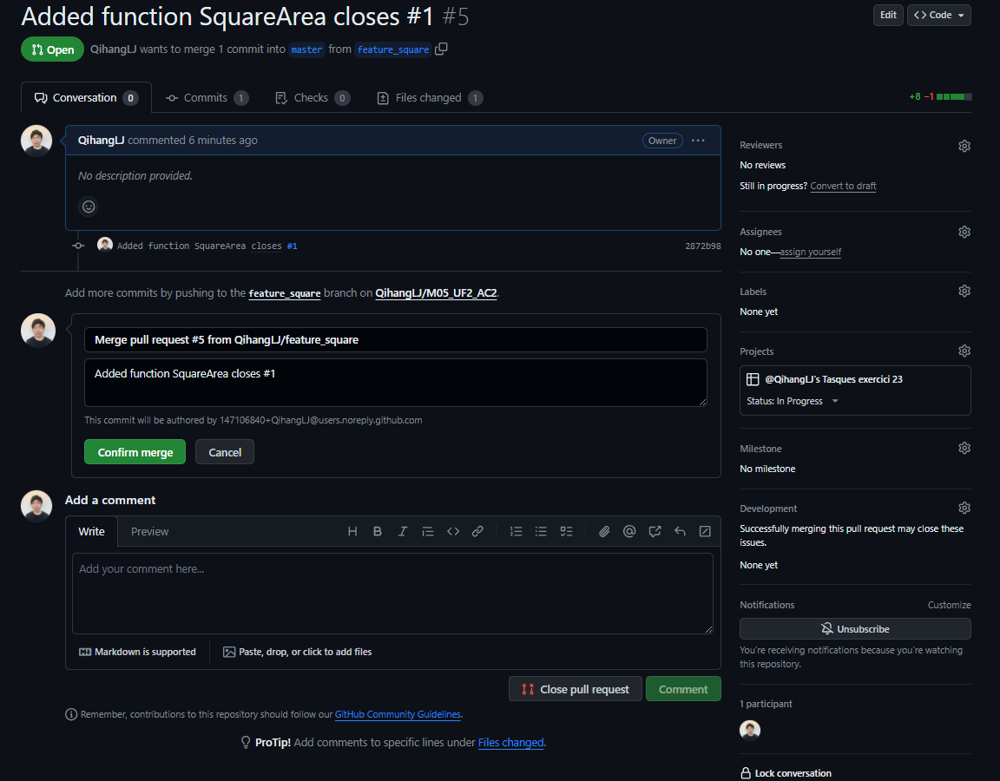

- Després de realitzar el merge, si anem a l'apartat de projectes, veurem que la nostra tasca pasa a situarse a la columna de "Done" es a dir, fet. També veurem que ens ha afegit una nova tasca com "done", que només vol dir que la tasca s'ha completat correctament i a més el merge també s'ha fet corectament.

  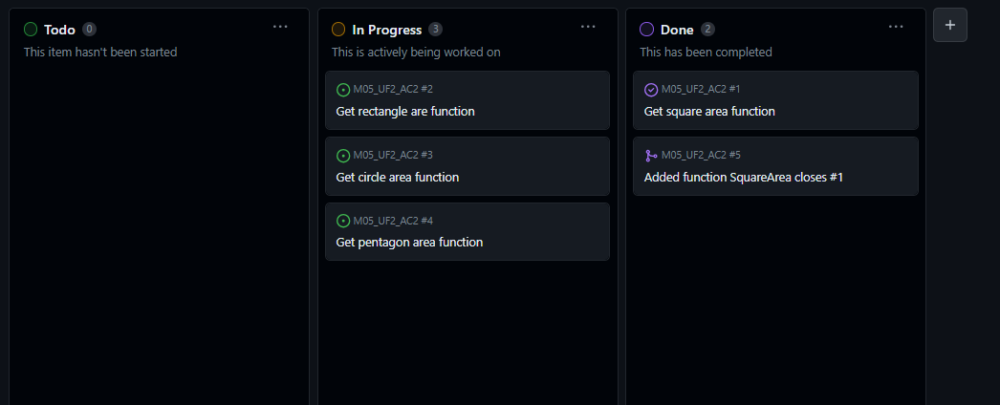

  
