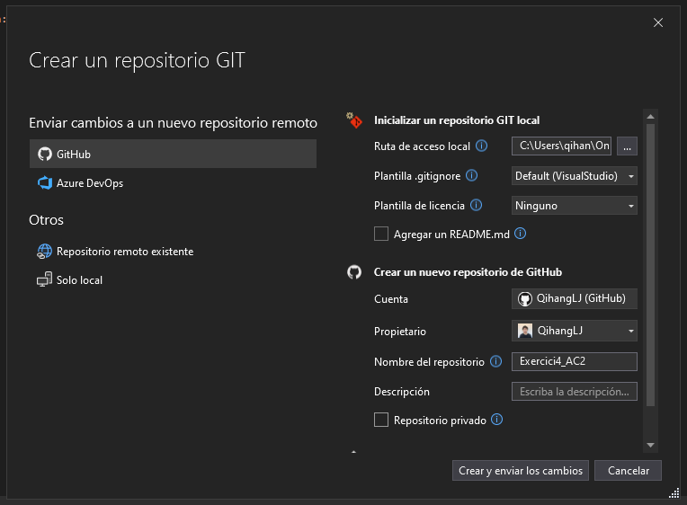
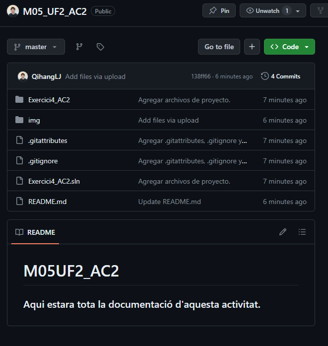

# M05UF2_AC2
### Aqui estara tota la documentació d'aquesta activitat.
## PAS 1:
- Crearem un nou projecte al Visual Studio i també crearem un repositori d'aquest projecte, ja sigui a través del Github o directament des del Visual.

(En el meu cas direcatement des del visual)

Configuramen el nostre repositori tal i com ens demana, en public, amb un README.md, etc. I hauria de quedar d'aquesta manera.

